# Delegate - AI-Powered Task Delegation for Slack

## What is Delegate?

Meetings are where decisions get made but without a structured handoff, the tasks that come out of them fall through the cracks. Follow-ups get forgotten, deadlines slip, and the organizer is left chasing people down manually.

Delegate fixes this entirely within Slack. An organizer uploads a meeting transcript (PDF or DOCX) directly into the Delegate bot DM. The app uses AI to extract action items, identify who owns each task, and send individualised task DMs to the right people. Task owners reply in-thread to mark things done, request deadline extensions, or request reassignment, all of which route back to the organizer for approval. Organizers can also ask the bot questions regarding the past meetings they attended and get answers synthesised directly from their past meeting transcripts.

## What's Next?

- **Jira Integration** - push delegated tasks directly to Jira as tickets, instead of storing in external database.
- **Deadline Reminders** - proactive DMs to task owners as deadlines approach, and escalation alerts to organizers when tasks are overdue.

---

## Table of Contents

1. [Product Walkthrough](#product-walkthrough)
2. [Responsible AI](#responsible-ai)
3. [Tech Stack Used](#tech-stack-used)
4. [Why These Technologies?](#why-these-technologies)
5. [System Architecture Diagram](#system-architecture-diagram)
6. [Key Decisions Made](#key-decisions-made)
7. [Evaluations](#evaluations)

8. [View PRD](#view-prd)

---

## Product Walkthrough

### Task Delegation Flow

**1. Upload and Read Transcript**

The organizer uploads a meeting transcript (PDF or DOCX) directly into the Delegate bot DM. The bot reads the file and begins extracting action items.

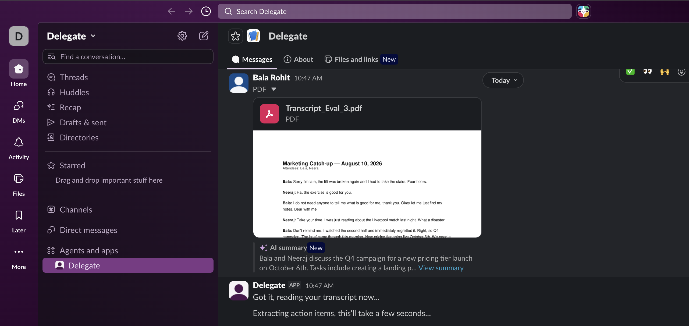

**2. View Extracted Tasks**

The bot presents all extracted tasks in a review card before anything is sent. Each task shows the owner, description, and due date. If a name from the transcript could not be matched to a Slack user, an unmatched warning is shown and the organizer can manually assign someone from within the organisation. If a match is found, the Slack user is tagged automatically and no manual action is needed.

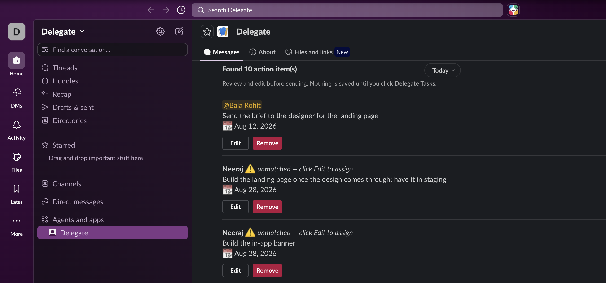

**3. Edit Task**

The organizer can edit any task before sending, including the description, owner, and due date, via a modal.

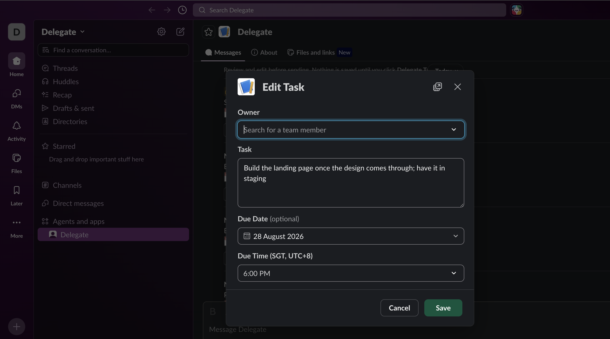

**4. Delegate Tasks**

Once the organizer is satisfied, they confirm and the bot sends individualised task DMs to each owner.

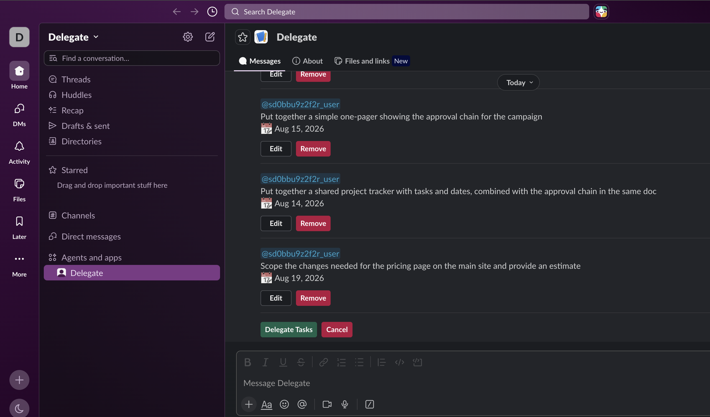

**5. Tasks Assigned to Oneself**

What a task DM looks like from the perspective of someone who is delegating tasks but at least one of the tasks belong to himself/herself.

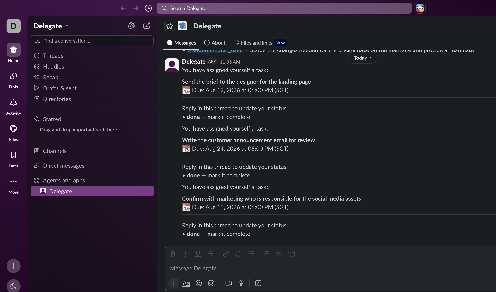

**6. Tasks Assigned to Another Person**

What the task DM looks like from the perspective of another person who received a task in the same delegation batch.

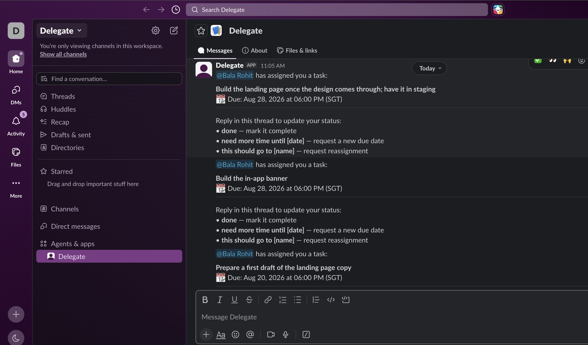

**7. Request for Extension**

A task owner can reply in-thread to request a deadline extension or reassignment. The bot routes the request to the organizer for approval.

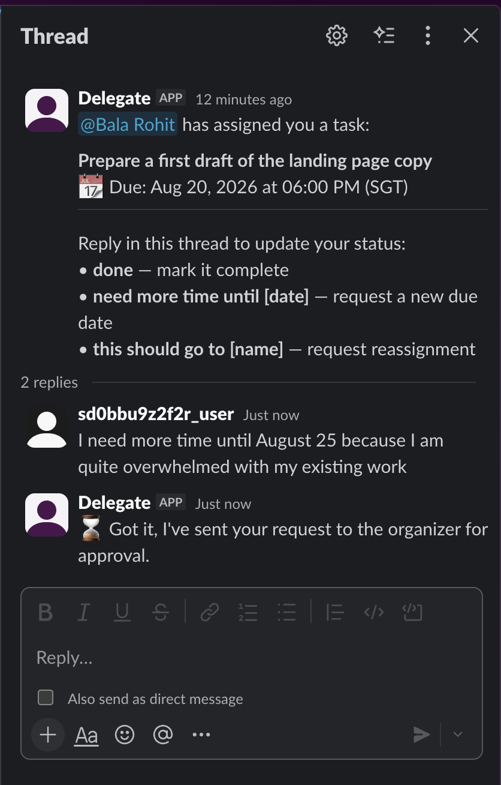

**8. Approve or Deny Request**

The organizer receives an approval card with the request details and can approve or deny with an optional reason.

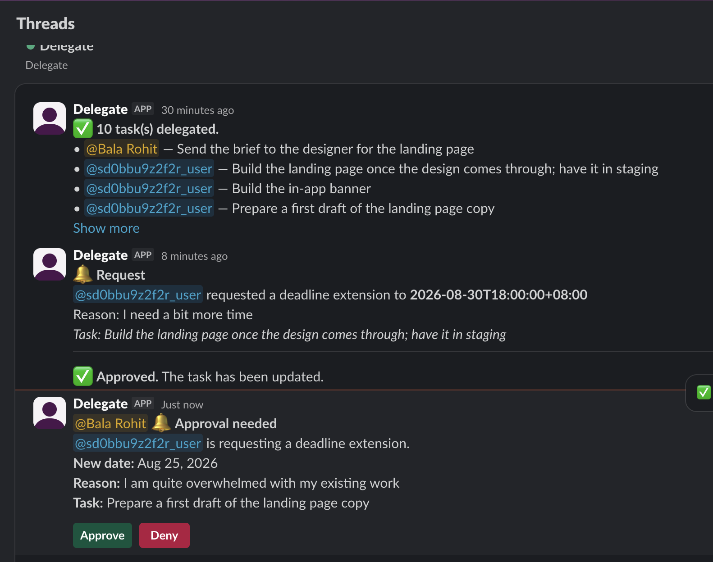

**9. Get Updated on Request**

The task owner is notified in their original task thread once the organizer approves or denies the request.

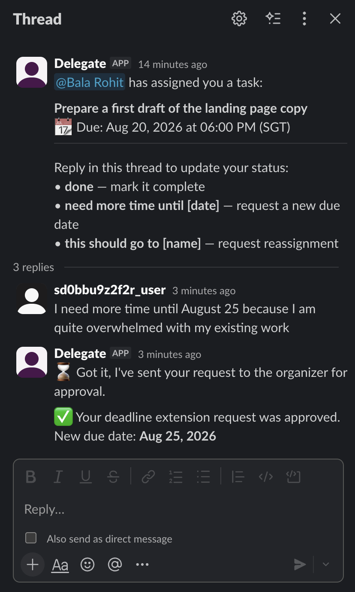

**10. Mark Task as Done**

The task owner replies in-thread to mark their task as complete. The organizer is notified and the task status is updated.

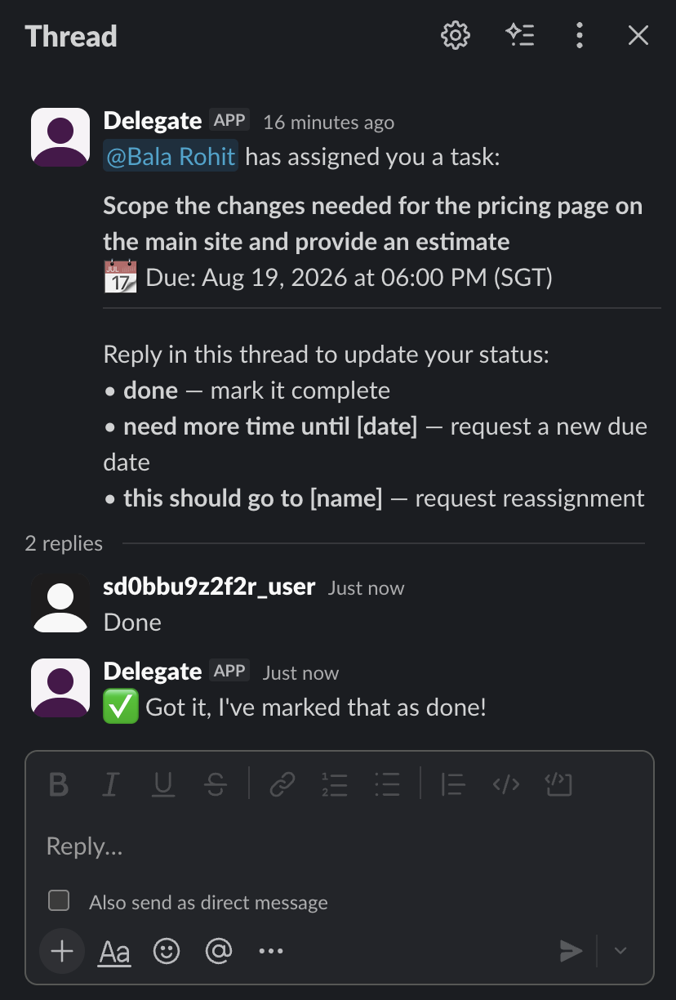

---

### Delegate Commands

**Commands Overview**

A summary of all available slash commands.

**1. Delegate Status**

Shows the most recent delegation batch with the current status of each task.

**2. Delegate Digest**

Shows all past delegations grouped by meeting, with done and pending tasks.

**3. Delegate Digest (Overdue)**

The digest also surfaces overdue tasks so the organizer can follow up immediately.

**4. Delegate Cancel**

The organizer can cancel any active task. The task owner is notified in their task DM thread.

---

### Search Feature

**RAG Search with Transparency**

Organizers can ask the bot questions about past meetings either by directly messaging or using the command /delegate [search query]. The bot retrieves the most relevant transcript chunks, passes them through an LLM reranker to filter noise, and finally formulates a grounded answer. Sources are shown so the user knows exactly which transcript the answer came from.

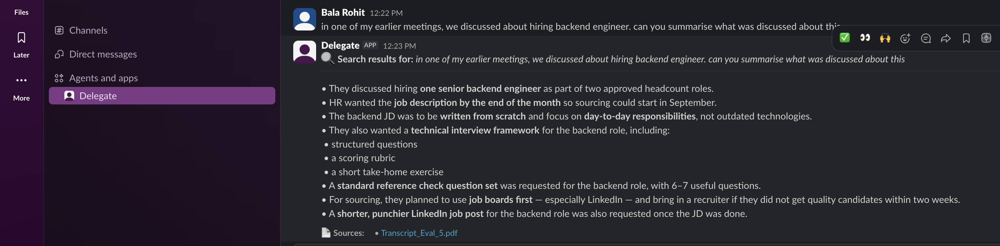

**How this was built**

The query is embedded using the same embedding model used at upload time. The embedding is scored via cosine similarity against all stored transcript chunks and the top 10 chunks are retrieved. An LLM reranker then labels each chunk as relevant or not in a single call. Only the relevant chunks are passed to the answer LLM, which synthesises a response grounded strictly in that context.

> LLMs are good at binary evaluation (relevant / not relevant) rather than assigning a numeric score, since a score is hard to interpret meaningfully without a clear reference point.

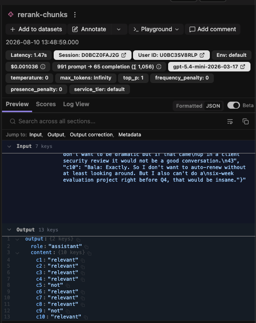

*The reranker labels each chunk as relevant or not relevant in a single LLM call.*

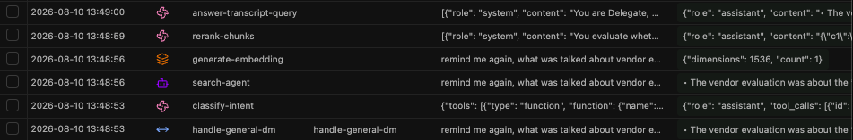

*Each step of the pipeline (embedding, retrieval, reranking, and answer generation) is traced in Langfuse with token counts and latency.*

---

## Responsible AI

When the search feature returns an answer, Delegate shows the user which transcript the answer was sourced from. This is an intentional design decision rooted in transparency and trust. AI-generated answers can be wrong, and users should always be able to verify the source themselves. By surfacing the originating transcript as a clickable link, we give users the means to check the answer against the actual meeting record rather than having to take it on faith.

### Guardrails

Delegate enforces a strict access boundary on the search feature. If a user asks about a meeting they were not part of, the bot will refuse to answer. Search results are scoped only to transcripts where the person asking was a participant. This ensures that sensitive meeting content is never surfaced to someone who had no business being in that meeting.

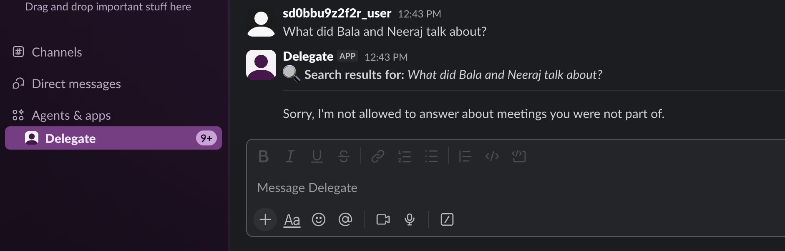

---

## Tech Stack Used

| Layer | Technology |
|---|---|
| Bot Framework | Slack Bolt (Python) |
| LLM | OpenAI GPT-5.4-mini |
| Embeddings | OpenAI text-embedding-3-small |
| Database | AWS DynamoDB |
| Token Encryption | AWS KMS |
| API Server | FastAPI |
| LLM Observability | Langfuse |

---

## Why These Technologies?

**Slack Bolt (Python)** - Delegate lives inside Slack, so building natively on Bolt gave us the full event handling, block kit, and OAuth surface without abstraction layers. Socket Mode allowed rapid local development without exposing a public endpoint during iteration.

**OpenAI GPT-5.4-mini** - Task extraction, reply interpretation, and semantic search answers all require language understanding. GPT-5.4-mini hits the right balance of capability and cost for high-frequency operations like per-transcript extraction and per-query answering.

**OpenAI text-embedding-3-small** - Fast, cheap, and accurate enough for semantic similarity over meeting transcript chunks. Used to embed both transcript chunks at upload time and user queries at search time.

**AWS DynamoDB** - Serverless, pay-per-request, and schema-flexible. Since each workspace has its own isolated data and load patterns vary significantly, DynamoDB's on-demand billing avoids over-provisioning. The multi-tenant model scoped entirely by `workspace_id` maps cleanly onto DynamoDB's partition key design.

**AWS KMS** - Bot tokens are sensitive credentials. KMS ensures they are never stored in plaintext, with encryption and decryption happening server-side without the key ever touching application memory.

**FastAPI** - Handles the OAuth install flow (the `/slack/install` and `/slack/oauth/callback` endpoints). Thin, fast, and easy to deploy alongside the Bolt app.

**Langfuse** - LLM observability. Every extraction, embedding, search, and reranking call is traced with token counts and latency, which feeds directly into the internal cost monitor.

---

## System Architecture Diagram

---

## Key Decisions Made

### 1. Programmatic Tool Routing over LLM-Driven Tool Calling

The master orchestrator uses an LLM to classify intent and return a route name. The actual tool or agent is then invoked by our code, not by the LLM itself.

The alternative is to let the LLM call tools directly and chain them autonomously, which is how frameworks like LangChain agents and OpenAI Assistants work. This is more powerful for open-ended tasks where the LLM needs to reason about which tools to call and in what order. However it is harder to debug, can loop unpredictably, and costs more per query.

For Delegate, the set of possible actions is fixed and well-defined. The routing decisions are simple enough that autonomous tool chaining adds unpredictability without meaningful benefit. Programmatic routing gives us full control over what runs, in what order, and makes failures easy to trace.

### 2. Sliding Window for Conversational Memory

To support follow-up questions, Delegate stores the last 3 exchanges (user message and bot answer) per user in DynamoDB and injects them into the LLM's context window on every query.

Alternatives considered:

- **Full history** - passing the entire conversation would grow the context window unboundedly, increasing cost and latency with every message, and introducing older irrelevant context that can confuse the LLM.
- **Vector search over history** - embedding past messages and retrieving semantically similar ones adds significant complexity for a conversational assistant where recency matters more than semantic similarity.
- **No memory** - every query treated as standalone. Simple, but breaks follow-up questions entirely ("what about the second point?" would fail).

The sliding window keeps context bounded, cost predictable, and recency preserved. 3 exchanges covers the vast majority of real follow-up patterns in a meeting assistant context.

### 3. Human-in-the-Loop Task Review

When the LLM extracts tasks from a transcript, they are not sent to task owners immediately. Instead, the organizer is shown a review card first and must explicitly confirm before anything is dispatched.

This is an intentional design decision rooted in valuing human oversight. LLMs can misattribute tasks, miss context, or extract something that sounds like an action item but was not actually agreed upon. By requiring the organizer to take a glance and confirm, we ensure there is always a human checking the output before it reaches someone's inbox. This prevents incorrectly assigned tasks from silently falling through and maintains trust in the delegation process.

---

## Evaluations

> Note: Evaluations were conducted on 5 transcripts only. We acknowledge this is a small sample size. In production, a minimum of 30 samples is recommended to satisfy the central limit theorem and draw statistically meaningful conclusions. Personal time constraints limited the scope here.

[View Full Evaluation Spreadsheet](https://docs.google.com/spreadsheets/d/1Pg1o8ZiQYTf6QPvQC84f2wK7_0HIL0nOLO3tZlXNFNg/edit?usp=sharing)

### Part 1 - Task Extraction

Evaluated on 5 AI-generated meeting transcripts that mimic real workplace conversations. For each transcript, tasks were manually extracted (owner, description, due date) and cross-compared against what the LLM returned. A match was determined by judgement - if the LLM-extracted task and the manually extracted task were substantively the same, it counted as a match.

Two dimensions were measured:

**Correctness** - of the tasks the LLM extracted, how many were actually valid tasks that exist in the transcript? This catches hallucinated or incorrectly attributed tasks.

**Completeness** - of all real tasks present in the transcript, how many did the LLM find? This catches tasks the LLM missed entirely.

### Part 2 - RAG Evaluation

Evaluated using the RAGAS framework.

*The Delegate Internal Monitor that was custom built showing search logs used for faithfulness review.*

**Faithfulness** - the LLM answer is broken down into individual sentences. Each sentence is checked against the retrieved context to verify it is grounded in what was actually retrieved and not hallucinated.

**Context Relevance** - modified to suit our use case. Rather than comparing at the sentence level within a chunk, we measure how many of the retrieved chunks were relevant to answering the query. This is more appropriate for speaker-turn based chunking where the chunk is the atomic unit of meaning, not the individual sentence.

**Answer Relevance** (not yet measured) - given the answer the LLM produced, prompt another LLM to generate a question that the answer would be responding to. Then measure how closely that generated question aligns with the original user query using cosine similarity. A high score means the answer is actually addressing what was asked. A low score means the answer may be technically grounded but off-topic. This metric should be incorporated in production to fully close the evaluation loop.

---

## View PRD

> ❯ Success metrics to look at when evaluating Delegate have been documented in the PRD.

[View Full PRD](https://drive.google.com/file/d/1UPFsBdgRBO31ns7nS9FS1xXNftQN6TYf/view?usp=sharing)

